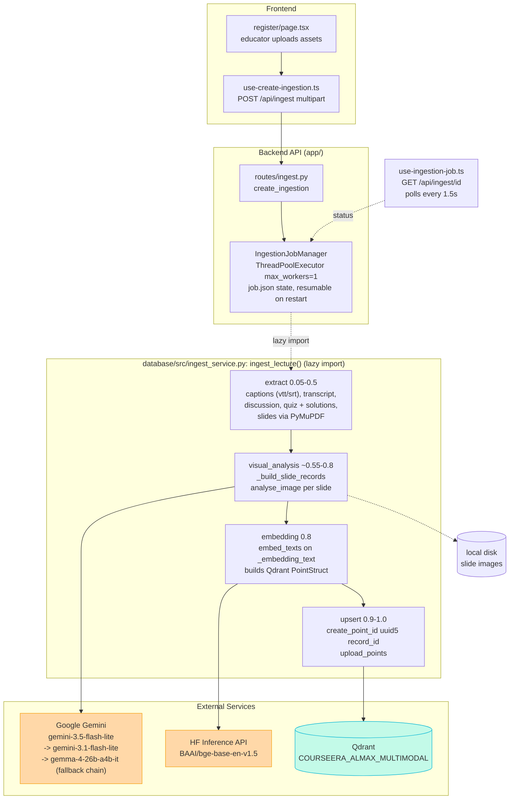
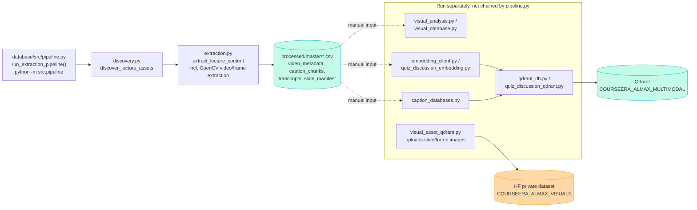
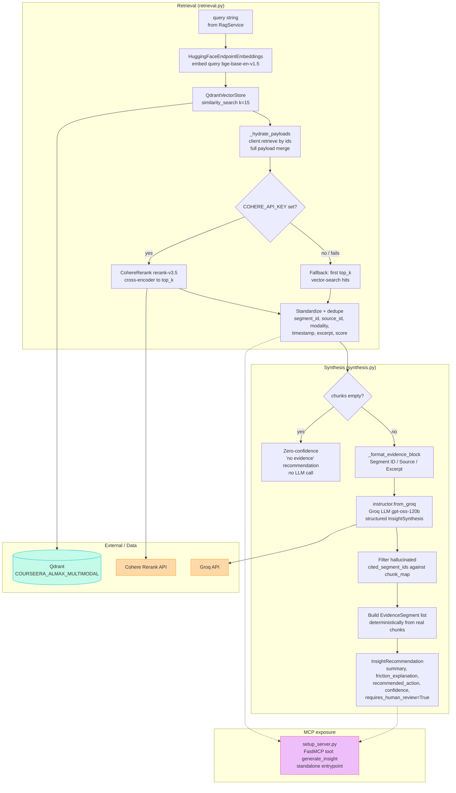
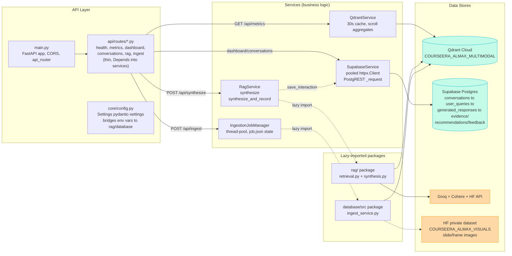
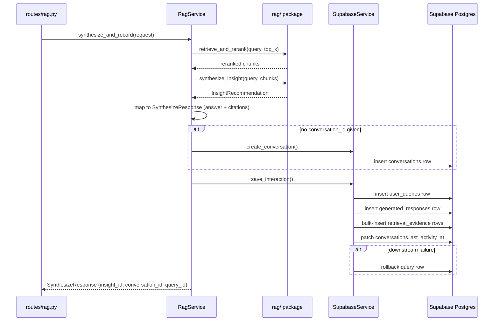
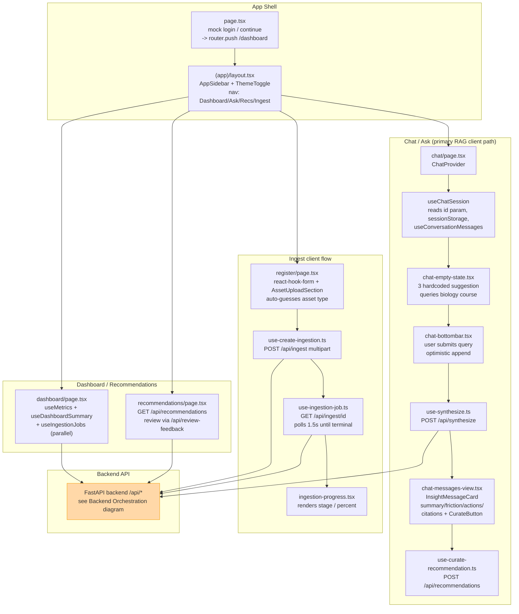

# Architecture Diagrams

Mermaid diagrams for the four core pipelines in this repo. Rendered automatically on GitHub/GitLab, or in any Mermaid-compatible viewer.

## 1. Ingestion Pipeline

There is one wired, end-to-end pipeline: the **online per-lecture path**, driven by the UI and running fully inside a single ingestion job. The **offline batch path** (`database/src/pipeline.py`) is a separate, narrower tool — it only discovers and extracts whole-course material to CSVs; it does not itself run visual analysis, embedding, or Qdrant upsert.

**Notes**
- Point IDs are deterministic (`uuid5` of `record_id`) so re-ingestion is idempotent.
- The same HF embedding model (`BAAI/bge-base-en-v1.5`) is used again at query time in the RAG pipeline, keeping the vector space consistent.
- The online path keeps slide images on **local disk only** — it never uploads to the HF private visual dataset (that only happens in the offline path, see below).
- Video/frame ingestion is explicitly out of scope for the online path; it stays in the offline discovery/extraction tooling.

### Offline batch tooling (whole-course processing)

This is **not** a single orchestrated pipeline — `pipeline.py` only covers discovery + extraction. Visual analysis, embedding, and Qdrant/HF upload for whole-course material are separate modules run independently; there is currently no script that chains all of them together end-to-end.

**Notes**
- Run via `python -m src.pipeline` from `backend/database/` (has a `if __name__ == "__main__":` entrypoint) — there is no wrapper CLI script anymore.
- `backend/database/README.md` currently describes `pipeline.py` as coordinating all pipeline stages; that's stale versus the code and shouldn't be trusted as-is.
- The HF private visual dataset (`COURSEERA_ALMAX_VISUALS`) is only ever written to from `visual_asset_qdrant.py`, i.e. only from this offline/batch side, never from the online per-lecture path.

---

## 2. RAG Pipeline

Standalone package at `backend/rag/`, importable by the FastAPI app and runnable independently as a FastMCP server.

**Notes**
- Citations are never LLM-generated prose UUIDs — `EvidenceSegment`s are built directly from real retrieval chunks, so cited evidence always points to actual data.
- `setup_server.py` wires `retrieve_and_rerank` → `synthesize_insight` into a single MCP tool (`generate_insight`), runnable standalone via `python rag/setup_server.py`, independent of the FastAPI app.

---

## 3. Backend Orchestration

FastAPI app at `backend/app/`, split into three independently-importable packages: `app/` (API layer), `rag/` (retrieval + synthesis), `database/` (ingestion pipeline + SQL). The API lazily imports the other two.

### `POST /api/synthesize` flow

---

## 4. Client Flow

Next.js 16 App Router app at `frontend/src/`, using TanStack React Query for server state and a shared Axios instance for HTTP.

**Notes**
- `api/axios.ts`: shared instance, `baseURL` from `NEXT_PUBLIC_API_URL`, 5-minute timeout (for long LLM/ingestion calls), request/response logging interceptors.
- All server state is managed via TanStack React Query (cache invalidation on mutation, e.g. invalidating `["conversations"]` after a successful synthesize call).
- `use-ingestion-jobs.ts` (list hook, plural) is shared by both the register page's "Recent ingestions" panel and the dashboard's Processing Monitor.
